## 🚀 OKampus – Votre Campus à portée de main  

OKampus est une application mobile moderne qui facilite la vie étudiante 📚✨.  
Elle propose plusieurs services pratiques : gestion du profil étudiant, accès rapide aux unités d’enseignement, réservation de chambres, suivi des activités, QR étudiant, chatbot intégré et bien plus encore.  

Découvrez ci-dessous un aperçu visuel des différentes interfaces de l’application :  

---

## 🖼️ Aperçu de l'application  

  
  

  
  

  
  

  
  

  
  

  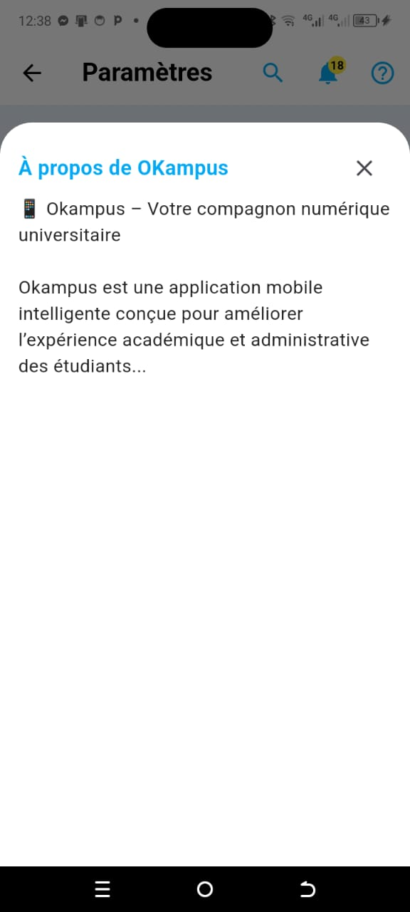
  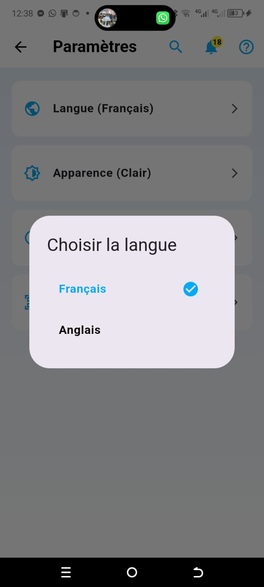

  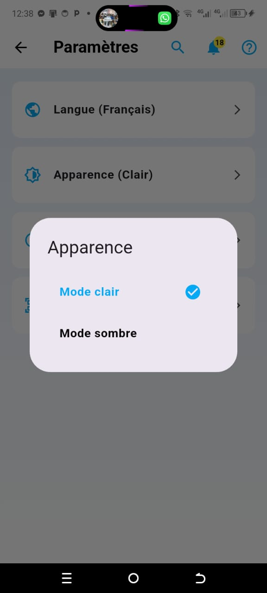
  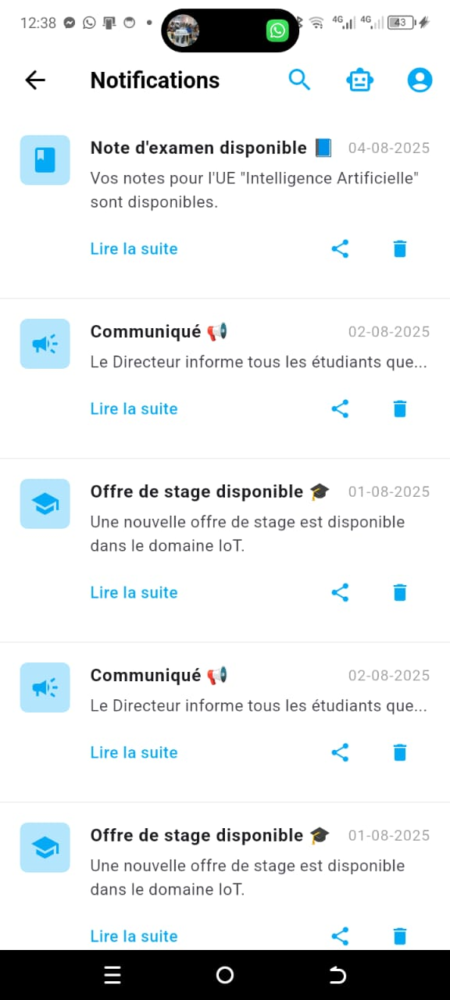

  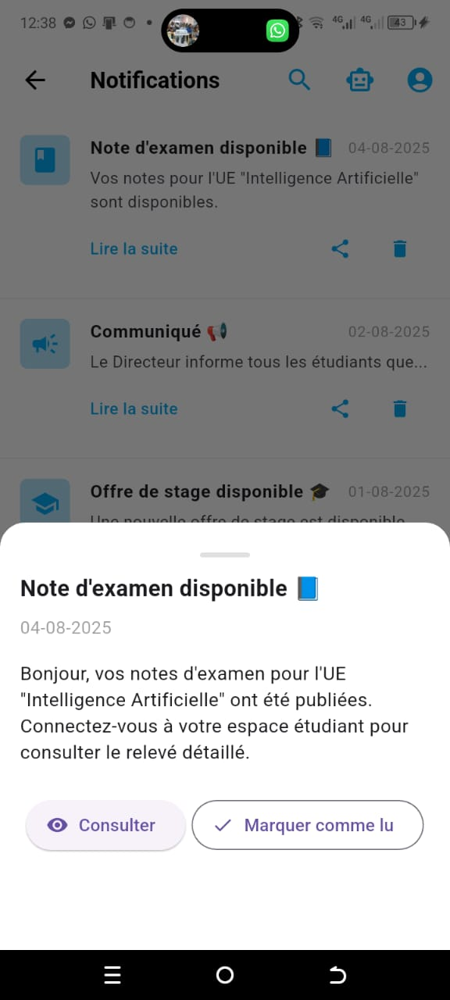
  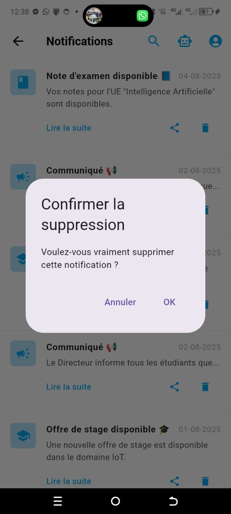

  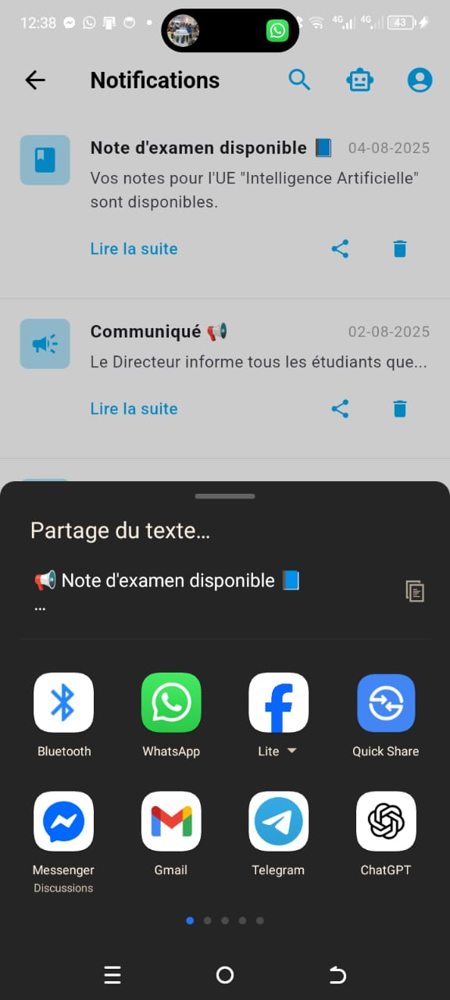
  

  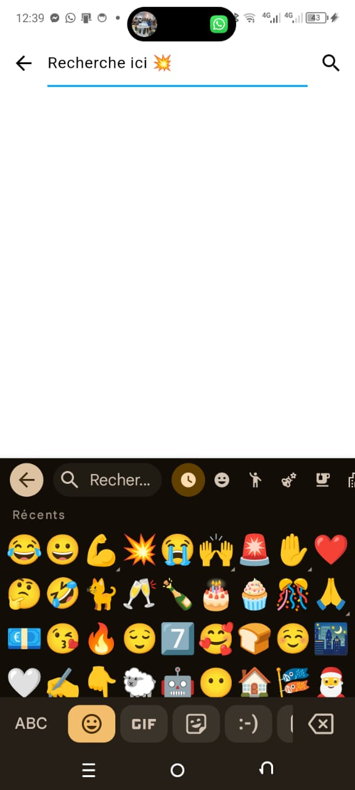
  

  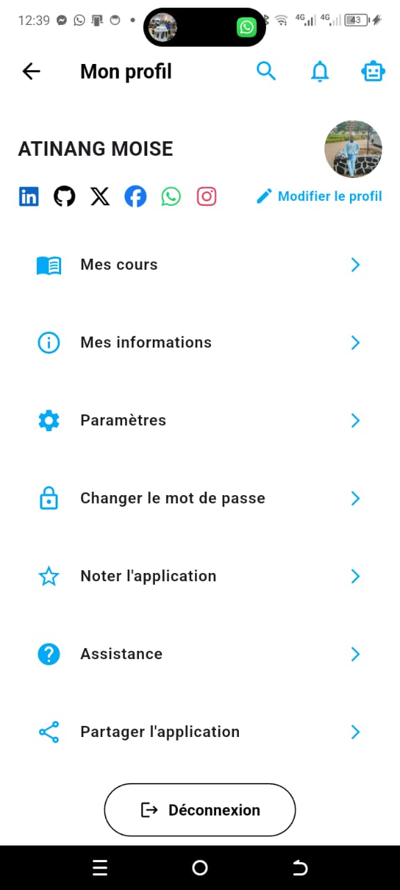
  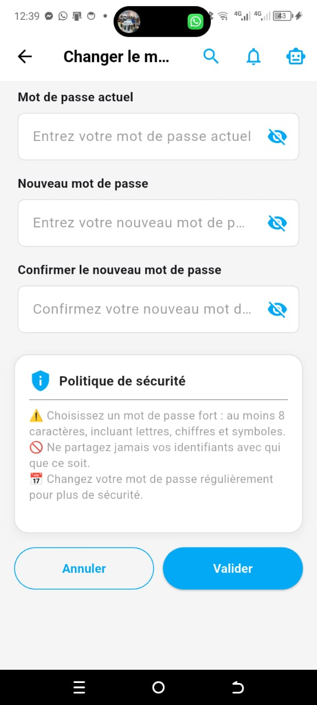

  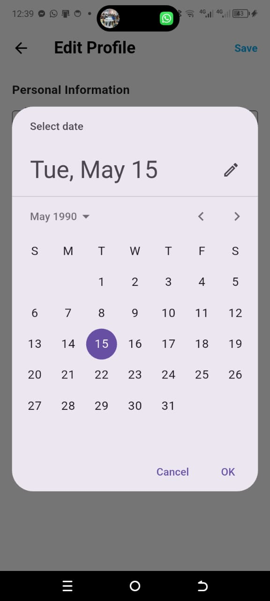
  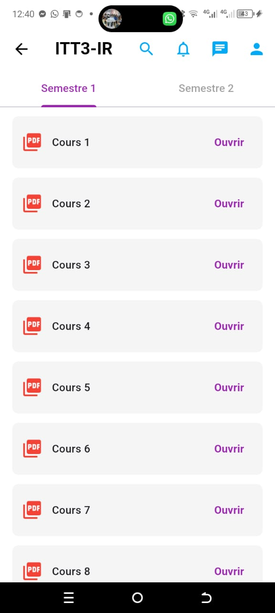

  

